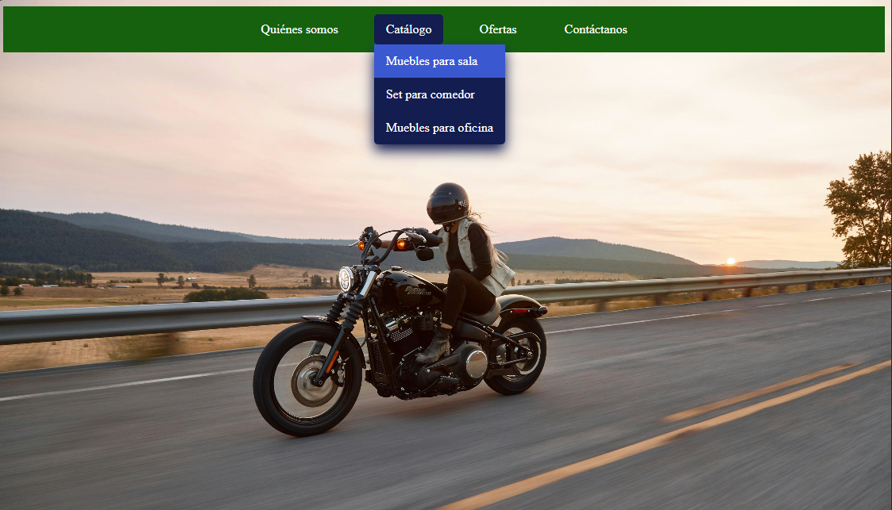

# Barra de Menú - HTML & CSS3

Dominar la creación de menús con HTML y CSS es fundamental para cualquier desarrollador web. No solo se trata de la apariencia, sino también de la usabilidad (UX), la accesibilidad y la optimización para motores de búsqueda (SEO).

## Menú Horizontal

El menú más fundamental es una lista de enlaces que se muestra de forma horizontal. Esto es perfecto para la navegación principal de un sitio web.

```html
    <nav>
        <ul class="menu-horizontal">
            <li><a href="#">Quiénes somos</a></li>
            <li><a href="#">Catálogo</a></li>
            <li><a href="#">Ofertas</a></li>
            <li><a href="#">Contáctanos</a></li>
        </ul>
    </nav>
```
### Ejemplo práctico 01

<div align="center">  

  

</div>

## Menú Horizontal con submenú 

Los menús desplegables son útiles cuando tienes muchas opciones y quieres organizarlas en subcategorías (ej. "Productos" con "Sedans", "SUVs", "Camionetas" debajo).

### Ejemplo práctico 02

<div align="center">  

  

</div>

## Menú Responsivo (Hamburguesa)

En la web moderna, tus menús deben verse y funcionar bien en cualquier dispositivo. En móviles, el espacio es limitado, por lo que convertimos el menú grande en un ícono de "hamburguesa" que se despliega.  

### Ejemplo práctico 03

<div align="center">  

  

</div>

<div align="center">  

  

</div>

<div align="center">  

  

</div>